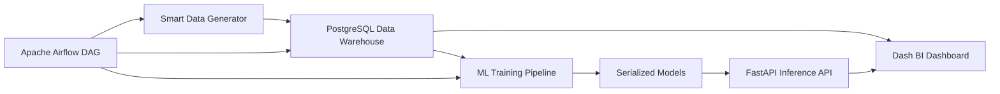
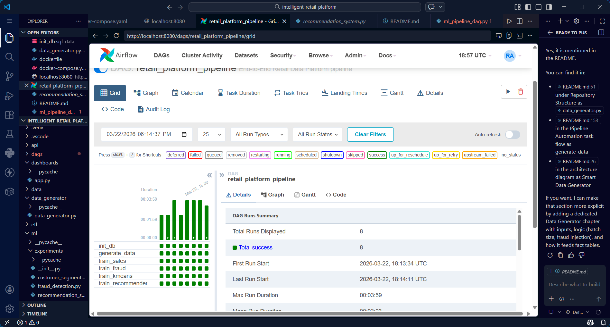

# Intelligent Retail Platform

An end-to-end data platform for retail analytics that combines:

- data generation and ingestion
- PostgreSQL warehouse modeling
- machine learning workflows
- prediction-serving APIs
- BI dashboards
- pipeline automation with Apache Airflow

The project is designed as a practical MLOps and analytics portfolio system where data moves continuously from raw events to business insights.

## Core Capabilities

- Airflow pipeline automation: [dags/ml_pipeline_dag.py](dags/ml_pipeline_dag.py) orchestrates schema initialization, data generation, and ML training.
- BI dashboarding: [dashboards/app.py](dashboards/app.py) provides live business KPIs and visualization layers for sales and fraud analysis.
- API inference: [api/main.py](api/main.py) serves real-time prediction and segmentation endpoints for downstream applications.

## 1. Business Goals

The platform answers core retail questions:

- How is revenue evolving over time?
- Which products generate the most revenue?
- Which transactions look suspicious?
- How can customers be segmented by behavior?
- How can model execution be automated and monitored?

## 2. High-Level Architecture



## 3. Technology Stack

- Data Storage: PostgreSQL 15
- Orchestration: Apache Airflow (standalone in Docker)
- ML: scikit-learn, XGBoost, NumPy, pandas
- API: FastAPI
- BI: Dash + Plotly
- Containerization: Docker Compose

## 4. Repository Structure

- [api/main.py](api/main.py): FastAPI service for predictions, segmentation, and health checks.
- [dashboards/app.py](dashboards/app.py): Dash BI dashboard for operational and analytics views.
- [dags/ml_pipeline_dag.py](dags/ml_pipeline_dag.py): Airflow DAG that automates DB initialization, data generation, and ML training tasks.
- [data/init_db.sql](data/init_db.sql): SQL bootstrap for warehouse schema.
- [data_generator/data_generator.py](data_generator/data_generator.py): streaming-style synthetic data insertion to fact tables.
- [etl/pipline.py](etl/pipline.py): batch ETL loader from CSV to star-schema style tables.
- [ml/pipelines/ml_pipeline.py](ml/pipelines/ml_pipeline.py): full ML pipeline (train, evaluate, persist models, write outputs to DB).
- [docker-compose.yaml](docker-compose.yaml): PostgreSQL + Airflow service orchestration.
- [dockerfile](dockerfile): custom Airflow image with ML dependencies.

## 5. Data Platform and Warehouse Layer

The platform stores data in PostgreSQL with dimensions and fact tables used by both ML and BI:

- Dimensions: products, customers, stores, dates
- Facts: sales transactions, fraud transactions
- Derived outputs: predictions, segmentation labels, recommendations, model metrics

This architecture supports:

- historical analysis
- model retraining
- dashboard aggregation queries
- API-powered inference and segmentation lookup

## 6. Machine Learning Layer

### Implemented ML capabilities

- Sales forecasting/regression
- Fraud anomaly detection (IsolationForest)
- Customer segmentation (KMeans)
- Product recommendations (correlation-based)

### Model artifacts

Saved model binaries are expected in:

- [ml/models](ml/models)

The API startup loads:

- sales_model.pkl
- fraud_model.pkl
- kmeans_model.pkl

## 7. API Layer (FastAPI)

Service file: [api/main.py](api/main.py)

Default local base URL:

- http://127.0.0.1:8000

Endpoints:

- GET /: service status message
- GET /health: DB and model readiness
- GET /predict_sales?quantity=<float>&discount=<float>
- GET /detect_fraud?amount=<float>
- GET /customer_segments

Example:

```bash
curl "http://127.0.0.1:8000/predict_sales?quantity=3&discount=0.1"
```

## 8. BI Layer (Dash Dashboard)

Dashboard file: [dashboards/app.py](dashboards/app.py)

Default local URL:

- http://127.0.0.1:8050

Visualizations include:

- Revenue over time
- Fraudulent transactions over time
- Top products by revenue
- Customer segmentation scatter plot

The dashboard refreshes automatically every 60 seconds and combines:

- direct SQL queries to PostgreSQL
- optional enrichment from the API customer segmentation endpoint

## 9. Pipeline Automation Layer (Airflow)

DAG file: [dags/ml_pipeline_dag.py](dags/ml_pipeline_dag.py)

DAG id:

- retail_platform_pipeline

Schedule:

- @hourly

Task flow:

1. init_db
2. generate_data
3. parallel training tasks:
   - train_sales
   - train_fraud
   - train_kmeans
   - train_recommender

Airflow Web UI (from Docker compose):

- http://localhost:8080

## 10. Quick Start (Docker)

### Prerequisites

- Docker Desktop
- Docker Compose plugin

### Start services

```bash
docker compose up -d --build postgres airflow
```

### Verify services

```bash
docker compose ps
```

### Trigger the DAG manually

```bash
docker compose exec -T airflow airflow dags unpause retail_platform_pipeline
docker compose exec -T airflow airflow dags trigger retail_platform_pipeline
docker compose exec -T airflow airflow dags list-runs --dag-id retail_platform_pipeline
```

### Check task states for a run

```bash
docker compose exec -T airflow airflow tasks states-for-dag-run retail_platform_pipeline <run_id>
```

### Stop services

```bash
docker compose down --remove-orphans
```

## 11. Local Development (without Docker for API and Dashboard)

Install dependencies in your virtual environment and run:

```bash
# API
uvicorn api.main:app --reload --host 0.0.0.0 --port 8000

# Dashboard
python dashboards/app.py
```

## 12. Configuration

Current configuration is centralized across:

- [docker-compose.yaml](docker-compose.yaml)
- [api/main.py](api/main.py)
- [dashboards/app.py](dashboards/app.py)
- [ml/utils/db_utils.py](ml/utils/db_utils.py)

Recommended environment variables:

- DB_HOST
- DB_USER
- DB_PASSWORD
- DB_NAME

For production or public repositories, move all credentials to environment variables and avoid hardcoding secrets in source files.

## 13. Observability and Validation

Useful runtime checks:

- API readiness: GET /health
- Airflow logs:

```bash
docker compose logs airflow --tail 100
```

- Airflow task history in UI or CLI
- model_metrics table for ML quality snapshots

## Screenshots

Store your images in:

- docs/images/

Then add screenshots with these filenames:

### Architecture (Power BI)


### Airflow Pipeline




### BI Dashboard - Revenue Analysis


### BI Dashboard - Fraud Analysis


### BI Dashboard - Top Products


### BI Dashboard - Customer Segmentation


### API Inference


## 14. Known Gaps and Hardening Checklist

Before production deployment:

- add a .gitignore file for virtual envs, caches, and temporary logs
- pin and complete dependencies in requirements.txt
- remove hardcoded credentials from all modules
- add unit/integration tests for API and pipeline tasks
- add CI pipeline for linting, tests, and image build
- standardize schema strategy between SQL bootstrap and ETL scripts

## 15. Suggested Next Evolution

- Add feature store style intermediate tables
- Add model registry/versioning and drift monitoring
- Add role-based access and API auth
- Add data quality checks before model training
- Deploy dashboard and API behind reverse proxy

## 16. License

Add your preferred license file (MIT, Apache-2.0, etc.) before public release.
